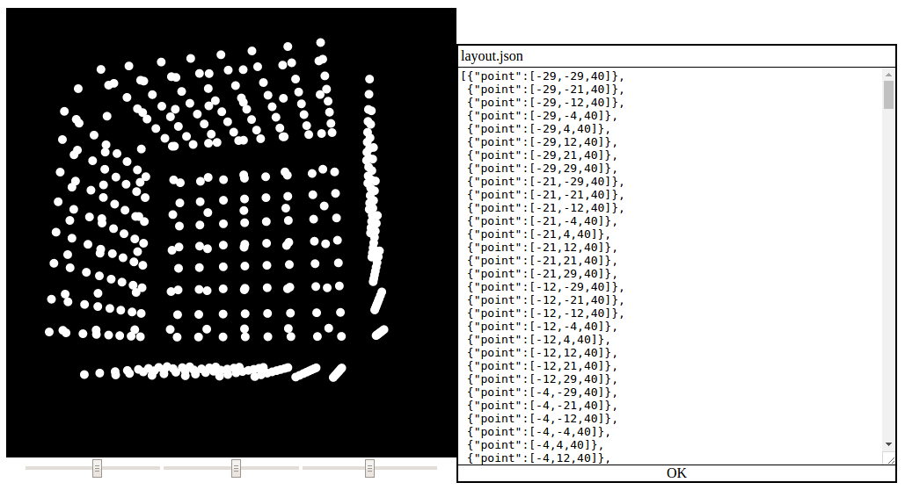

# OPC Preview, an OPC JSON layout viewer

Got a layout JSON file, but not sure what it looks like?
This should help!

Some Fadecandy & Open Pixel Control programs use a layout JSON file to define
the layout of the LEDs in 3D space. The projects include some examples and
generators, but there was no easy way to see what they look like, or if what you
made was correct!



This is loosely based on the work from [mikolalysenko/svg-3d-simplicial-complex](https://github.com/mikolalysenko/svg-3d-simplicial-complex).

# How to use

Its hosted over here: https://mic159.github.io/opcpreview/

On the left, you will see the current preview, and underneath it is the
3d rotation controls.

On the right is the JSON file currently loaded.
To view your layout, just paste it into the text area!

# Some example layouts:

- [scanlime/fadecandy](https://github.com/scanlime/fadecandy/tree/master/examples/layouts)
    - https://github.com/scanlime/fadecandy/blob/master/examples/layouts/grid32x16z.json
    - https://github.com/scanlime/fadecandy/blob/master/examples/layouts/grid8x8.json
    - https://github.com/scanlime/fadecandy/blob/master/examples/layouts/ring24.json
    - https://github.com/scanlime/fadecandy/blob/master/examples/layouts/strip64.json
    - https://github.com/scanlime/fadecandy/blob/master/examples/layouts/triangle16.json
- [zestyping/openpixelcontrol](https://github.com/zestyping/openpixelcontrol/tree/master/layouts)
    - https://github.com/zestyping/openpixelcontrol/blob/master/layouts/cylinder_r1_h1_64x20.json
    - https://github.com/zestyping/openpixelcontrol/blob/master/layouts/circle_r1_50x.json

# Development / installation

Prerequisites:

- NodeJS & NPM (Tested with 6.X)
- Python 2 (for dev server, optional)

```
git clone https://github.com/mic159/lampy.git
cd lampy
npm install
npm start &
npm run dev
```

Now open your browser to http://localhost:8000/
